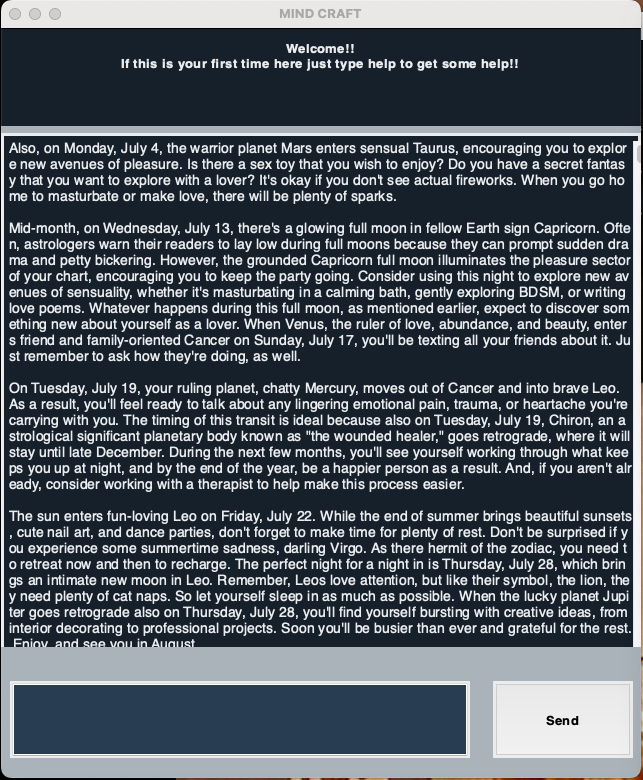

<div id="top"></div>
<!--
*** Thanks for checking out the Best-README-Template. If you have a suggestion
*** that would make this better, please fork the repo and create a pull request
*** or simply open an issue with the tag "enhancement".
*** Don't forget to give the project a star!
*** Thanks again! Now go create something AMAZING! :D
-->


<!-- PROJECT SHIELDS -->
<!--
*** I'm using markdown "reference style" links for readability.
*** Reference links are enclosed in brackets [ ] instead of parentheses ( ).
*** See the bottom of this document for the declaration of the reference variables
*** for contributors-url, forks-url, etc. This is an optional, concise syntax you may use.
*** https://www.markdownguide.org/basic-syntax/#reference-style-links
-->
[![Contributors][contributors-shield]][contributors-url]
[![Forks][forks-shield]][forks-url]
[![Stargazers][stars-shield]][stars-url]
[![Issues][issues-shield]][issues-url]
[![MIT License][license-shield]][license-url]
[![LinkedIn][linkedin-shield]][linkedin-url]


<!-- PROJECT LOGO -->
<br />
<div align="center">
  <a href="https://github.com/jeremaquai/MIND-CRAFT">
    
  </a>

<h3 align="center">MIND CRAFT</h3>

  <p align="center">
    At the current moment, this is just a small chat bot to play around and amuse yourself with.  This is my first attempt at a fully functional chat bot complete with a GUI. The concept is based on the coin operated Fortune Teller machines from my childhood with some of my own flare added into the mix.
    <br />
    <a href="https://github.com/jeremaquai/MIND-CRAFT"><strong>Explore the docs »</strong></a>
    <br />
    <br />
    <a href="https://github.com/jeremaquai/MIND-CRAFT">View Demo</a>
    ·
    <a href="https://github.com/jeremaquai/MIND-CRAFT/issues">Report Bug</a>
    ·
    <a href="https://github.com/jeremaquai/MIND-CRAFT/issues">Request Feature</a>
  </p>
</div>


<!-- TABLE OF CONTENTS -->
<details>
  <summary>Table of Contents</summary>
  <ol>
    <li>
      <a href="#about-the-project">About The Project</a>
      <ul>
        <li><a href="#built-with">Built With</a></li>
      </ul>
    </li>
    <li>
      <a href="#getting-started">Getting Started</a>
      <ul>
        <li><a href="#prerequisites">Prerequisites</a></li>
        <li><a href="#installation">Installation</a></li>
      </ul>
    </li>
    <li><a href="#usage">Usage</a></li>
    <li><a href="#roadmap">Roadmap</a></li>
    <li><a href="#contributing">Contributing</a></li>
    <li><a href="#license">License</a></li>
    <li><a href="#contact">Contact</a></li>
    <li><a href="#acknowledgments">Acknowledgments</a></li>
  </ol>
</details>


<!-- ABOUT THE PROJECT -->
## About The Project

[![Product Name Screen Shot][product-screenshot]](https://example.com)

# MIND CRAFT


<p align="right">(<a href="#top">back to top</a>)</p>


### Built With

* [Python](https://python.org/)
* [Anaconda](https://anaconda.com/)


<p align="right">(<a href="#top">back to top</a>)</p>


<!-- GETTING STARTED -->
## Getting Started

To get a local copy up and running follow these simple example steps.

### Prerequisites


* python 3.9.12
* anaconda library

### Installation

1. Check that you have python 3.9.12 or higher installed. Copy and paste the following command to the terminal.
  ```sh
  python --version
  ```
2. Download Python 3.9.12 and install following the instructions for your os at the following link if not already installed.

    [Python.org](https://python.org)

3. Download and install the latest Anaconda distribution if its not already installed on your computer from the following link.

    [Anaconda.com](https://anaconda.com)

4. Clone the repo
   ```sh
   git clone https://github.com/jeremaquai/MIND-CRAFT.git
   ```
5. Open a new terminal at the file location of your repo clone and enter the following command to enjoy THE MIND CRAFT chat bot
   ```sh
   python3 chat_app.py
   ```


<p align="right">(<a href="#top">back to top</a>)</p>


<!-- USAGE EXAMPLES -->
## Usage


MIND CRAFT is a fortune teller, so obviously you can ask it for a fortune and it will give you one. You may also ask for a lucky number and MIND CRAFT will give you a randomly generated number as your lucky numner. 

If you tell MIND CRAFT the year that you were born then it will respond with the Chinese Zodiac sign for the year that you were born in. If you tell MIND CRAFT your birthday in the Month Day format, it will reply to you with your astrological zodiac sign.

Once you have learned what your astrologica zodiac sign is, you can ask MIND CRAFT for either a monthy or yearly horoscope for your sign. MIND CRAFT was created and published in early July 2022 so these responses are hard coded into the bot and therefore may become dated without constant updating or a function that can keep the bot outomatically updated (a function that I currently lack the knowledge to write). 

As well as being able to get a horoscope for your astrological zodiac sign, you can ask MIND CRAFT for a personality profile of your sign to see how accurate it is.


All horoscopes and personality profiles were sourced from [Allure.com](Allure.com)


<p align="right">(<a href="#top">back to top</a>)</p>


<!-- ROADMAP -->


See the [open issues](https://github.com/jeremaquai/MIND-CRAFT/issues) for a full list of proposed features (and known issues).

<p align="right">(<a href="#top">back to top</a>)</p>


<!-- CONTRIBUTING -->
## Contributing

Contributions are what make the open source community such an amazing place to learn, inspire, and create. Any contributions you make are **greatly appreciated**.

If you have a suggestion that would make this better, please fork the repo and create a pull request. You can also simply open an issue with the tag "enhancement".
Don't forget to give the project a star! Thanks again!

1. Fork the Project
2. Create your Feature Branch (`git checkout -b feature/AmazingFeature`)
3. Commit your Changes (`git commit -m 'Add some AmazingFeature'`)
4. Push to the Branch (`git push origin feature/AmazingFeature`)
5. Open a Pull Request

<p align="right">(<a href="#top">back to top</a>)</p>


<!-- LICENSE -->
## License

Distributed under the Creative Commons License. See `LICENSE.md` for more information.

<p align="right">(<a href="#top">back to top</a>)</p>


<!-- CONTACT -->
## Contact

Jeremaquai - jeremaquai@gmail.com.com

Project Link: [https://github.com/jeremaquai/MIND-CRAFT](https://github.com/jeremaquai/MIND-CRAFT)

<p align="right">(<a href="#top">back to top</a>)</p>


<!-- ACKNOWLEDGMENTS -->


<!-- MARKDOWN LINKS & IMAGES -->
<!-- https://www.markdownguide.org/basic-syntax/#reference-style-links -->
[contributors-shield]: https://img.shields.io/github/contributors/jeremaquai/MIND-CRAFT.svg?style=for-the-badge
[contributors-url]: https://github.com/jeremaquai/MIND-CRAFT/graphs/contributors
[forks-shield]: https://img.shields.io/github/forks/jeremaquai/MIND-CRAFT.svg?style=for-the-badge
[forks-url]: https://github.com/jeremaquai/MIND-CRAFT/network/members
[stars-shield]: https://img.shields.io/github/stars/jeremaquai/MIND-CRAFT.svg?style=for-the-badge
[stars-url]: https://github.com/jeremaquai/MIND-CRAFT/stargazers
[issues-shield]: https://img.shields.io/github/issues/jeremaquai/MIND-CRAFT.svg?style=for-the-badge
[issues-url]: https://github.com/jeremaquai/MIND-CRAFT/issues
[license-shield]: https://img.shields.io/github/license/jeremaquai/MIND-CRAFT.svg?style=for-the-badge
[license-url]: https://github.com/jeremaquai/MIND-CRAFT/blob/master/LICENSE.txt
[linkedin-shield]: https://img.shields.io/badge/-LinkedIn-black.svg?style=for-the-badge&logo=linkedin&colorB=555
[linkedin-url]: https://linkedin.com/in/jeremiah-sparks-0ba36a239
[product-screenshot]: images/MIND_CRAFT_screenshot.png
